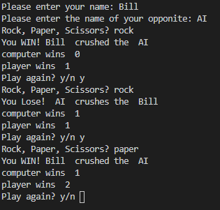

# Summery
This program plays the game rock paper scissors.
The user enters a name for the user and computer, then chooses which move it wants to play
keeps track of score as the game goes on

# Development enviroment
* Python 3.7.8
* Visual sudio code

# Exicution
*to exicute the program `Python program 3 RPS.py`
 

# Usfull websites
